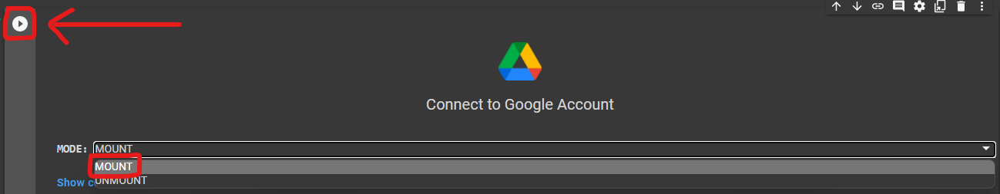
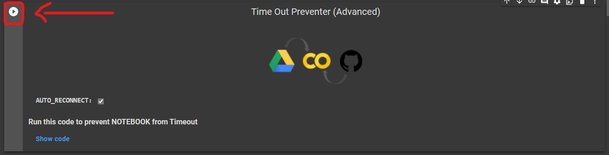
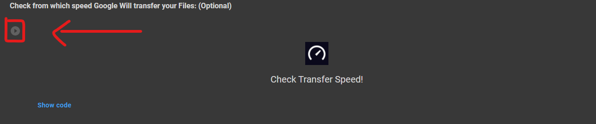
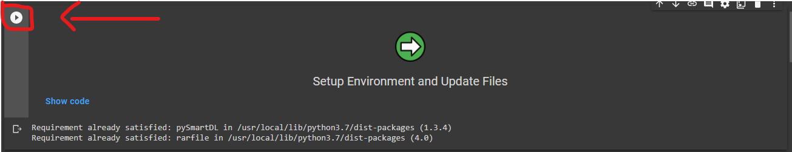
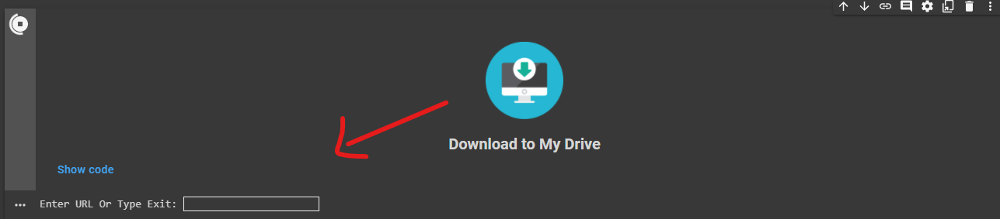
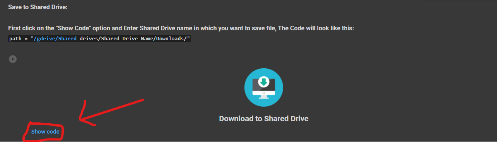
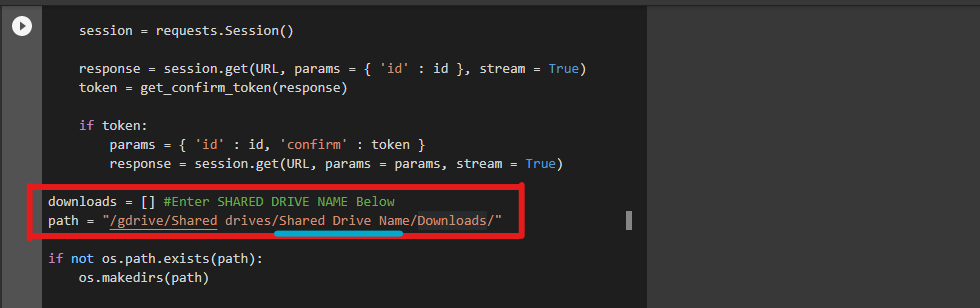
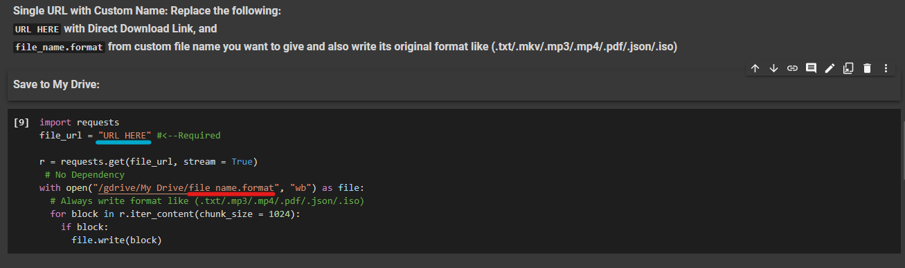
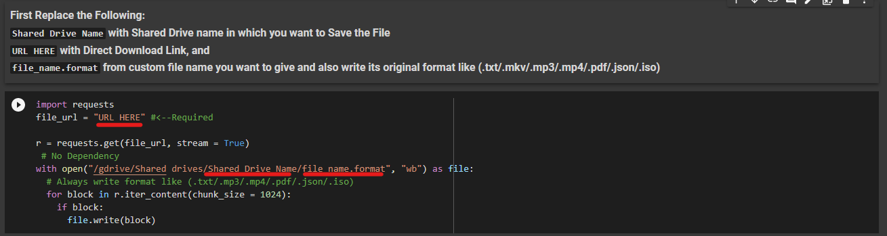
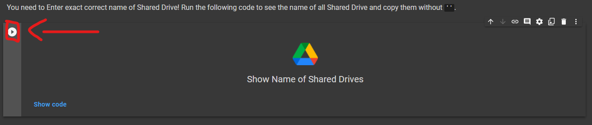

# Direct Link to Google Drive

<b>The Most Advanced yet Simple Google Colab Notebook to Download Files from Direct Link to Google Drive.</b>

<h2>🆕What's New?🆕</h2>
<h4><b>1.Download with Custom Name!🤩</b></h4>
<h4><b>2.Auto Extraction After Downloading!😊</b></h4>
<h4><b>3.Multiple Download Link Support!😁</b></h4>
<h4><b>4.My Drive & Shared Drive Support!😎</b></h4>
<h4><b>5.Integreated Speed Tester!😙</b></h4>
<h4><b>6.With Auto-Reconnector!🙃</b></h4>
<h2>⚙️ How to Use ?</h2>
<h4><b>1.First  in Google Colab and Connect your Google Drive account! Select the "Mount" option from Drop Down list and Run the code as shown in the Image.</b></h4>

<h4><b>2.Run the Auto-Reconnector to prevent Timout in Google Colab.(Optional)</b></h4>

<h4><b>3.You can also check from which speed, Google is going to download your file, this can vary depending upon the downloading source.(Optional)</b></h4>

<h4><b>4.As already written above! You can download single or multiple Direct Download Link at a time, Before doing it you need to download some files! So run the code as shown to automatically do it.</b></h4>

<b><i>❗However if you do this method twice then it will show "Requirements already satisfied" as an Output which is Normal and will not cause any problem❗</i></b>

<h4><b>5.Now, if you want to save single/multiple links in your My Drive then you can directly run the code as shown and it will ask you to Enter the Direct Download Link! Just type it and press ENTER key, now either you can type as many links as you want or directly type Exit and hit Enter to directly starts Downloading process.If the Downloaded file is in .zip or .rar then Program will also ask to choose to extract it or not!</b></h4>

<h4><b>6.While if you want to download single/multiple links in Shared Drive, then you have to Enter exact Correct name of Shared Drive in the Code! To do that click "Show Code" option and Enter the name of your Shared Drive as shown in the Image.The Shared Drive name entered should be exist in the Account you connected previously in STEP 1.</b></h4>

<h4><b>After Entering the Shared Drive Name, Simply run the code and  Enter Direct Download Link</b></h4>
<h2>🪄Download with Custom Name</h2>
<h4><b>1.To Download File to My Drive with custom name, Replace "URL HERE" with Direct Download Link and "file_name.format" from custom file name you want to give and also write its original format like (.txt/.mkv/.mp3/.mp4/.pdf/.json/.iso) as shown in the Image</b></h4>

<h4><b>2.To Download File to Shared Drive with custom name, Replace "Shared Drive Name" with with Shared Drive name in which you want to Save the File, "URL HERE" with Direct Download Link, and "file_name.format" from custom file name you want to give and also write its original format like (.txt/.mkv/.mp3/.mp4/.pdf/.json/.iso)</b></h4>

<h3><b>📚Getting Shared Drive Name</b></h3>
<h4><b>As you need to Enter Correct Shared Drive Name in Some cases in this Project you can run the Code as shown in the Image to Get the names of Shared Drive available in your Connected Google Drive Account! Just copy and paste them without ("").</b></h4>

<h2><b>🔥Download using Google Drive Link</b></h2>
<h4><b>You can also use download file to your Google Drive Account using Google Drive File Sharing link! But first you need to convert it into Direct Download link, For doing that open my Google Drive Direct Link Generator and paste the Normal Link there and copy the Output Link and use that link in this Program.</b></h4>
<h4><b><a href="https://www.caduceus.ml/Google-Drive-Direct-Link/">Open Converter</a></b></h4>
<h2><b>😛Download using MEGA Link</b></h2>
<h4><b>Do you know! If you deploy your own MEGA Index then you can Watch or Download Unlimited Files from your MEGA Account without any limitations! You can use the Direct Link of File from your MEGA INDEX UNLIMITED with this program to Download it or even with large number of CLI(s). Click the Following to make your own MEGA INDEX UNLIMITED:</b></h4>
<h4><b><a href="https://www.caduceus.ml/MEGA-INDEX/">Create MEGA UNLIMITED INDEX</a></b></h4>
<h2>〽️Variables Used</h2>
<h4><b>1.Shared Drive Name: Replace with the Shared Drive name in which file needs to be downloaded.</b></h4>
<h4><b>2.PATH: Location or Address of My Drive or Shared Drive to Download File in it.</b></h4>
<h4><b>3.File_name.format: Replace From custom file name you want to give and also write its original format like (.txt/.mkv/.mp3/.mp4/.pdf/.json/.iso).</b></h4>
<h4><b>4.URL HERE: Replace with the Direct Download Link.</b></h4>
<h2>📑Packages Used</h2>
<h4>1.RaR Package for Extraction.(Official)</h4>
<h2>🎯Points to be Remembered🎯</h2>
<h4><b>1.You can download Unlimited Multiple Links at a time.</b></h4>
<h4><b>2.If you try to download Setup file twice then it will show "Requirements already satisfied" as an Output which is Normal and will not cause any problem.</b></h4>
<h4><b>3.Always type the original format with custom file name.</b></h4>
<h2> 🔐 Safe or Not? ✅</h2>
<h4><b> 1.Don't Worry! No data will be shared with anyone, if you use the <a href="https://github.com/TheCaduceus/Direct-Link-to-Google-Drive">Original code</a>.🔒</b></h4>
<h4><b> 2.This code do not share even a single piece of data to any third party source and not create any log of that!🔑</b></h4>
<h4><b> 3.Do not trust any other copy of this Code.📚</b></h4>
<h2> 🤔 Why Use This?</h2>
<h4><b>If you use Google Collab for Long term use, then you can understand that it requires Human Interaction atleast one time per 90 Minutes! Otherwise it will cancel the task and all your Work will got failed! But this Repository comes with the code which prevent this. Yes you heard it right just click on the "Play Code Button" of "Auto-Reconnecter" and then don't worry about time out! Also sometimes it become defficult to download/upload Files directly to Shared Drives, So we have added a dedicated Shared Drive Section in the UI. We update every Repository on a regular Basis and fix Problems reported to us by our Users!</b></h4>
<h2> 📥Download</h2>
<h4><b> You can also Download this GitHub Repository as (.zip) file:</b></h4>
<h4><b>Available Versions for Download:</b></h4>
<h4><b>v2.2.1:<a href="https://github.com/TheCaduceus/Direct-Link-to-Google-Drive/archive/refs/heads/main.zip"> Download Now</a> (Latest)</b></h4>
<h2>⛑Contact Us!</h2>
<h4><b>Join our Update Channel at Telegram:<a href="https://telegram.me/TheCaduceusUPDATE"> Join Now!</b></a>
<h4><b>Directly Contact the Developer using Telegram <a href="https://telegram.me/HelpAutomatted_Bot">@HelpAutomatted_Bot</a></b></h4>
<h2>❤️Credits & Thanks</h2>

<b><a href="https://github.com/TheCaduceus">Dr.Caduceus</a>: For making UI and Collab Notebook.</b>

